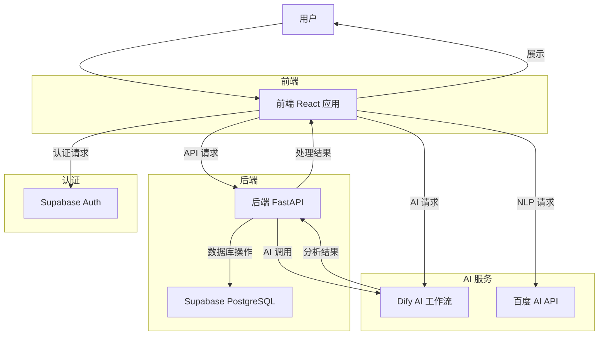
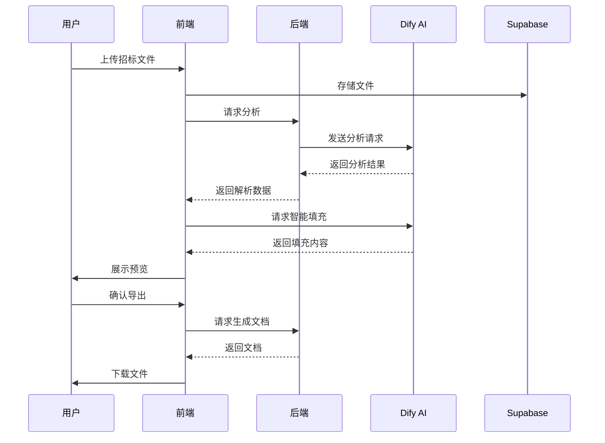

# AI Bid System 项目文档

## 1. 项目概述

### 1.1 系统介绍

AI Bid System 是一个基于人工智能的投标文档自动生成和分析系统。该系统利用 AI 技术帮助用户快速生成、分析和优化投标文档，大幅提高投标效率和成功率。

### 1.2 核心价值

- **智能投标生成**：基于模板和用户输入自动生成投标文档
- **文档分析**：分析招标文件，提取关键信息和要求
- **空白填充**：智能识别和填充文档中的空白字段
- **知识库管理**：管理公司信息、产品库、图片库等投标资源
- **学习模式**：通过 AI 学习投标文档的最佳实践

### 1.3 目标用户

- 企业投标人员
- 商务拓展团队
- 项目管理团队

---

## 2. 技术栈

### 2.1 前端技术栈

| 技术 | 版本 | 用途 |
|------|------|------|
| React | 18.2.0 | 前端框架 |
| Vite | 5.1.4 | 构建工具 |
| Ant Design | 5.16.0 | UI 组件库 |
| Tailwind CSS | 3.4.1 | CSS 框架 |
| react-router-dom | 6.22.0 | 路由管理 |
| @supabase/supabase-js | 2.99.2 | 数据库和认证客户端 |
| pdfjs-dist | 5.5.207 | PDF 渲染 |
| mammoth | 1.12.0 | Word 文档转换 |
| docx-preview | 0.3.7 | Word 文档预览 |
| react-markdown | 10.1.0 | Markdown 渲染 |
| lucide-react | 0.577.0 | 图标库 |
| file-saver | 2.0.5 | 文件下载 |
| pizzip | 3.2.0 | ZIP 文件处理 |

### 2.2 前端开发工具

| 工具 | 版本 | 用途 |
|------|------|------|
| ESLint | 8.56.0 | 代码检查 |
| @vitejs/plugin-react | 4.2.1 | React 插件 |
| postcss | 8.4.38 | CSS 处理 |
| autoprefixer | 10.4.19 | CSS 前缀 |

### 2.3 后端技术栈

| 技术 | 版本 | 用途 |
|------|------|------|
| FastAPI | >=0.104.0 | Web 框架 |
| uvicorn | >=0.24.0 | ASGI 服务器 |
| python-docx | >=1.0.0 | Word 文档处理 |
| python-multipart | >=0.0.6 | 文件上传处理 |
| pydantic | >=2.0.0 | 数据验证 |
| python-dotenv | >=1.0.0 | 环境变量管理 |
| requests | >=2.31.0 | HTTP 客户端 |
| beautifulsoup4 | >=4.12.0 | HTML 解析 |
| docxcompose | >=2.1.0 | Word 文档合并 |

### 2.4 数据库与认证

| 技术 | 用途 |
|------|------|
| Supabase (PostgreSQL) | 关系型数据库 |
| Supabase Auth | 用户认证和授权 |

### 2.5 AI 集成

| 技术 | 用途 |
|------|------|
| Dify AI 工作流 | AI 驱动的智能分析和填充 |
| 百度 AI API | 自然语言处理 |

### 2.6 构建与部署

| 工具 | 用途 |
|------|------|
| Docker Compose | 容器化部署 |
| npm | 前端依赖管理 |
| Node.js | 前端运行环境 |
| Python 3.8+ | 后端运行环境 |

---

## 3. 系统架构

### 3.1 目录结构

```
ai-bid-system/
├── frontend/                    # React 前端应用
│   ├── src/
│   │   ├── components/          # 可复用组件
│   │   │   ├── Layout.jsx       # 布局组件
│   │   │   ├── Sidebar.jsx      # 侧边栏导航
│   │   │   └── ProtectedRoute.jsx # 路由保护
│   │   ├── pages/               # 页面组件
│   │   │   ├── Login.jsx        # 登录页
│   │   │   ├── Register.jsx     # 注册页
│   │   │   ├── ForgotPassword.jsx # 找回密码
│   │   │   ├── CreateBid.jsx    # 新建标书
│   │   │   ├── MyBids.jsx       # 我的标书
│   │   │   ├── BidAnalysis.jsx  # 招标分析
│   │   │   ├── BidDetail.jsx    # 标书详情
│   │   │   ├── KnowledgeBase.jsx # 知识库
│   │   │   ├── ImageLibrary.jsx # 图片库
│   │   │   ├── CompanyProfile.jsx # 投标主体库
│   │   │   ├── ProductLibrary.jsx # 产品资产库
│   │   │   ├── LearnBid.jsx     # 历史标书整理
│   │   │   ├── PersonnelLibrary.jsx # 人员专家库
│   │   │   └── Profile.jsx      # 个人资料
│   │   ├── utils/               # 工具函数
│   │   │   ├── intelligentMapping.js # 智能映射
│   │   │   ├── wordBlankFiller.js    # 空白填充
│   │   │   └── difyWorkflow.js       # Dify 工作流
│   │   ├── hooks/               # React Hooks
│   │   ├── contexts/            # React Context
│   │   └── App.jsx              # 路由入口
│   ├── package.json             # 前端依赖
│   ├── vite.config.js           # Vite 配置
│   └── tailwind.config.js       # Tailwind 配置
├── backend/                     # Python 后端服务
│   ├── routes/                  # API 路由
│   │   ├── merge_docs.py        # 文档合并
│   │   ├── fill_blanks.py       # 空白填充
│   │   ├── parse_bid.py         # 招标解析
│   │   └── intelligent_mapping.py # 智能映射
│   ├── requirements.txt         # Python 依赖
│   ├── .env                     # 环境变量
│   └── Dockerfile               # Docker 镜像
├── supabase/                    # Supabase 配置
│   ├── migrations/              # 数据库迁移脚本
│   └── config.toml              # Supabase 配置
├── docker-compose.yml           # Docker Compose 配置
├── README.md                    # 项目说明
├── start.sh                     # Linux 启动脚本
└── start.bat                    # Windows 启动脚本
```

### 3.2 模块划分

#### 前端模块

- **认证模块**：用户登录、注册、密码管理（基于 Supabase Auth）
- **标书管理模块**：创建、查看、编辑、删除标书
- **招标分析模块**：上传招标文件，AI 分析并生成报告
- **资源库模块**：知识库、图片库、产品库、人员库等管理
- **个人资料模块**：用户信息和公司信息管理

#### 后端模块

- **文档处理模块**：Word 文档解析、空白识别、内容填充
- **AI 集成模块**：Dify 工作流调用、智能映射
- **API 服务模块**：RESTful API 接口

#### AI 模块

- **Dify 工作流**：驱动智能分析和填充流程
- **字段映射**：智能识别文档字段并映射到对应数据
- **百度 AI**：自然语言处理辅助

### 3.3 数据流向



### 3.4 核心业务流程



---

## 4. 环境配置

### 4.1 环境变量清单

#### 前端环境变量

在 `frontend/.env.local` 文件中配置：

| 变量名 | 说明 | 示例值 |
|--------|------|--------|
| VITE_SUPABASE_URL | Supabase 项目 URL | https://xxx.supabase.co |
| VITE_SUPABASE_ANON_KEY | Supabase 匿名密钥 | eyJhbGciOi... |
| VITE_DIFY_API_KEY | Dify API 密钥 | app-xxx |
| VITE_DIFY_WORKFLOW_ID | Dify 工作流 ID | workflow-xxx |
| VITE_DIFY_TARGET | Dify 后端地址（开发代理用） | http://localhost |

#### 后端环境变量

在 `backend/.env` 文件中配置：

| 变量名 | 说明 | 示例值 |
|--------|------|--------|
| DIFY_BASE_URL | Dify API 基础地址 | http://192.168.169.107/v1 |
| DIFY_FIELD_MAPPING_API_KEY | 字段映射 API Key | app-SvjCxTrr0S7AXP5Bo13HmuUU |
| ENABLE_INTELLIGENT_MAPPING | 启用智能映射 | true/false |

### 4.2 代理配置

前端开发服务器（Vite）配置了以下代理规则（`frontend/vite.config.js`）：

| 路径前缀 | 目标地址 | 说明 |
|----------|----------|------|
| /v1 | VITE_DIFY_TARGET 或 http://localhost | Dify AI 接口代理 |
| /api | http://localhost:8000 | 后端 API 代理 |
| /baidu-api | https://aip.baidubce.com | 百度 AI API 代理（路径重写） |

### 4.3 启动流程

#### 本地开发

**前端启动：**

```bash
cd frontend
npm install
npm run dev
```

访问地址：http://localhost:5173

**后端启动：**

方式一：直接运行 Python 服务
```bash
cd backend
python -m uvicorn main:app --host 0.0.0.0 --port 8000 --reload
```

方式二：使用 Docker Compose
```bash
docker-compose up -d
```

后端服务端口：http://localhost:8000

#### 生产部署

**前端构建：**

```bash
cd frontend
npm run build
```

构建产物位于 `frontend/dist/` 目录，可部署到 Vercel、Netlify 等静态托管服务。

**后端部署：**

```bash
docker-compose up -d
```

或使用进程管理器（PM2/systemd）运行 Python 服务。

---

## 5. 用户操作手册

### 5.1 认证系统

#### 5.1.1 用户登录

- **入口路径**：/login
- **操作步骤**：
  1. 打开系统登录页面
  2. 输入注册邮箱
  3. 输入密码
  4. 点击"登录"按钮
- **预期结果**：登录成功后跳转到系统主页（/create-bid）
- **注意事项**：
  - 请确保邮箱和密码正确
  - 忘记密码可点击"忘记密码"链接

#### 5.1.2 用户注册

- **入口路径**：/register
- **操作步骤**：
  1. 打开注册页面
  2. 填写姓名
  3. 填写邮箱地址
  4. 设置密码
  5. 确认密码
  6. 点击"注册"按钮
- **预期结果**：注册成功后自动登录并跳转到主页
- **注意事项**：
  - 邮箱地址必须有效（用于密码找回）
  - 密码需符合安全要求


### 5.2 新建标书

- **入口路径**：/create-bid
- **功能说明**：上传招标文件，通过 AI 智能分析和填充，生成投标文档

#### 操作步骤

1. **上传招标文件**
   - 点击上传区域或拖拽文件到上传区
   - 支持格式：.docx、.pdf
   - 文件大小限制：10MB

2. **AI 分析文档**
   - 系统自动解析上传的招标文件
   - 提取空白字段、表格结构等关键信息
   - 显示分析进度

3. **智能填充**
   - 系统根据知识库中的公司信息、产品资料等自动填充空白
   - 可手动调整填充内容
   - 支持模板匹配和资产引用

4. **审核与编辑**
   - 预览填充后的文档
   - 手动修改需要调整的内容
   - 查看智能审核结果

5. **导出文档**
   - 点击"导出"按钮
   - 系统生成完整的投标文档
   - 自动下载 .docx 文件

- **预期结果**：生成一份完整填充的投标文档，可直接用于投标
- **注意事项**：
  - 上传前请确认文件格式正确
  - 智能填充依赖知识库数据，请确保资料完整
  - 导出前务必人工审核关键内容

### 5.3 我的标书

- **入口路径**：/my-bids
- **功能说明**：查看、管理所有历史和在进行的标书项目

#### 操作步骤

1. **查看标书列表**
   - 进入页面后显示所有标书项目
   - 显示信息：项目名称、创建时间、状态、所属人

2. **搜索与筛选**
   - 使用搜索框按名称/描述搜索
   - 使用标签筛选：全部、已完成、处理中

3. **打开标书**
   - 点击标书条目
   - 根据项目状态跳转到编辑页或分析页

4. **管理标书**
   - 右键或点击操作菜单
   - 可选择"查看/编辑"或"永久删除"
   - 删除操作将清除原始文件和相关数据

5. **批量操作**
   - 支持多选标书
   - 批量删除选中的标书

- **预期结果**：能够方便地管理和访问所有标书项目
- **注意事项**：
  - 删除操作不可恢复，请谨慎操作
  - 处理中的标书可能仍在 AI 分析中

### 5.4 招标分析

- **入口路径**：/bid-analysis
- **功能说明**：上传招标文件进行 AI 分析，生成详细的解读报告

#### 操作步骤

1. **上传招标文件**
   - 拖拽或点击上传区域
   - 支持格式：.docx、.pdf

2. **AI 分析**
   - 系统自动上传文件到 Supabase
   - 创建新的招标项目记录
   - Dify AI 工作流开始分析
   - 显示分析进度条

3. **查看分析结果**
   - 分析完成后显示详细报告
   - 包含：招标框架、关键要求、清单等
   - 可点击具体项目查看详情

4. **导出报告**
   - 点击"下载报告"按钮
   - 下载分析结果文档

- **预期结果**：获得一份详细的招标文件分析报告，帮助理解招标要求
- **注意事项**：
  - 分析过程可能需要几分钟
  - 请保持页面不要关闭

### 5.5 资源库

#### 5.5.1 知识库

- **入口路径**：/knowledge-base
- **功能说明**：管理投标相关的知识和模板
- **操作步骤**：
  1. 进入知识库页面
  2. 点击"新建"创建知识条目
  3. 填写标题、内容、标签
  4. 上传相关附件（可选）
  5. 保存条目
- **预期结果**：知识条目保存成功，可在投标时引用

#### 5.5.2 图片库

- **入口路径**：/image-library
- **功能说明**：存储和管理投标相关图片资源
- **操作步骤**：
  1. 进入图片库页面
  2. 点击"上传图片"
  3. 选择图片文件
  4. 填写图片描述和标签
  5. 保存
- **预期结果**：图片上传成功，可在投标文档中引用

#### 5.5.3 投标主体库

- **入口路径**：/company-profiles
- **功能说明**：管理公司基本信息和资质
- **操作步骤**：
  1. 进入投标主体库页面
  2. 点击"新建主体"
  3. 填写公司基本信息（名称、地址、联系方式等）
  4. 上传资质文件（营业执照、资质证书等）
  5. 保存
- **预期结果**：公司主体信息保存成功，投标时自动引用

#### 5.5.4 产品资产库

- **入口路径**：/product-library
- **功能说明**：管理产品和服务信息
- **操作步骤**：
  1. 进入产品资产库页面
  2. 点击"新建产品"
  3. 填写产品信息（名称、描述、规格、价格等）
  4. 上传产品图片和文档
  5. 保存
- **预期结果**：产品信息保存成功，投标时自动填充

#### 5.5.5 历史标书整理

- **入口路径**：/learn-bid
- **功能说明**：上传历史投标文档，AI 学习最佳实践
- **操作步骤**：
  1. 进入历史标书整理页面
  2. 上传历史投标文档
  3. AI 分析文档结构和内容
  4. 提取成功经验和模板
  5. 保存到知识库
- **预期结果**：历史标书分析完成，经验可用于新投标

#### 5.5.6 人员专家库

- **入口路径**：/personnel-library
- **功能说明**：管理项目人员和专家信息
- **操作步骤**：
  1. 进入人员专家库页面
  2. 点击"新建人员"
  3. 填写人员信息（姓名、职位、联系方式等）
  4. 上传简历、资质证书等附件
  5. 设置拟在本项目担任的职务
  6. 填写项目经历
  7. 保存
- **预期结果**：人员信息保存成功，投标时可作为团队配置引用

### 5.6 个人资料

- **入口路径**：/profile
- **功能说明**：查看和编辑个人信息

#### 操作步骤

1. 进入个人资料页面
2. 查看当前个人信息
3. 点击"编辑"按钮
4. 修改用户名、所在公司等信息
5. 点击"保存"按钮
6. 页面显示最后更新时间

- **预期结果**：个人信息更新成功
- **注意事项**：
  - 邮箱地址不可修改（用于登录认证）
  - 修改密码请通过"忘记密码"流程

---

## 6. 开发指南

### 6.1 本地开发环境搭建

#### 前置要求

- Node.js 18+
- npm 9+
- Python 3.8+
- Docker（可选，用于容器化部署）
- Supabase 账号

#### 前端开发

```bash
# 1. 克隆项目
git clone https://github.com/wayneli1/AI-.git
cd ai-bid-system

# 2. 安装前端依赖
cd frontend
npm install

# 3. 配置环境变量
cp .env.example .env.local
# 编辑 .env.local 填写 Supabase 和 Dify 配置

# 4. 启动开发服务器
npm run dev
```

开发服务器地址：http://localhost:5173

#### 后端开发

```bash
# 方式一：直接运行
cd backend
pip install -r requirements.txt
python merge_server.py

# 方式二：Docker Compose
docker-compose up -d
```

后端服务地址：http://localhost:8000

### 6.2 构建流程

#### 前端构建

```bash
cd frontend
npm run build
```

构建产物输出到 `frontend/dist/` 目录。

#### 代码检查

```bash
cd frontend
npm run lint
```

### 6.3 部署流程

#### 前端部署

1. 构建生产版本：
   ```bash
   cd frontend
   npm run build
   ```

2. 将 `dist/` 目录部署到静态托管服务：
   - Vercel
   - Netlify
   - Nginx

3. 配置生产环境变量

#### 后端部署

**Docker Compose 部署：**

```bash
docker-compose up -d
```

**直接部署：**

1. 安装 Python 依赖：
   ```bash
   pip install -r backend/requirements.txt
   ```

2. 配置 `backend/.env` 环境变量

3. 启动服务：
   ```bash
   python merge_server.py
   ```

4. 使用 PM2 或 systemd 管理进程

### 6.4 代码规范

- 使用 ESLint 进行代码检查
- 遵循 React 最佳实践
- 使用函数组件和 Hooks
- 保持组件单一职责

### 6.5 添加新功能

1. 在 `frontend/src/pages/` 创建新页面组件
2. 在 `frontend/src/utils/` 添加工具函数
3. 在 `frontend/src/App.jsx` 更新路由配置
4. 如需数据库支持，添加相应的 Supabase 表
5. 如需后端支持，在 `backend/routes/` 添加新路由

### 6.6 数据库设置

1. 在 Supabase 控制台创建新项目
2. 运行数据库迁移脚本：
   ```bash
   cd supabase
   supabase db reset
   ```
3. 主要数据表：
   - `profiles`：用户信息
   - `bidding_projects`：标书项目
   - `company_profiles`：公司信息
   - `products`：产品信息
   - `product_assets`：产品资产
   - `images`：图片资源
   - `template_slots`：模板字段

---

## 7. 注意事项

### 7.1 安全

- `.env.local` 和 `backend/.env` 文件包含敏感信息，**不要提交到版本控制**
- Supabase 行级安全策略（RLS）已配置，确保数据访问安全
- Dify API Key 请妥善保管

### 7.2 性能

- 注意 Dify API 的调用频率限制
- 上传文件大小限制为 10MB
- 建议使用 Chrome 或 Edge 最新版本浏览器

### 7.3 故障排除

| 问题 | 解决方案 |
|------|----------|
| 无法连接 Supabase | 检查 VITE_SUPABASE_URL 和 VITE_SUPABASE_ANON_KEY 配置 |
| AI 分析失败 | 检查 Dify API Key 和工作流 ID 配置 |
| 文件上传失败 | 检查文件格式（.docx/.pdf）和大小限制 |
| 前端无法访问后端 | 确认后端服务已启动，代理配置正确 |

### 7.4 已知问题

- 重置密码路由（/reset-password）组件已存在但未在路由中显式绑定，需要在 `App.jsx` 中补充

---

## 8. 贡献指南

1. Fork 项目
2. 创建功能分支（`git checkout -b feature/xxx`）
3. 提交更改（`git commit -m 'feat: add xxx'`）
4. 推送到分支（`git push origin feature/xxx`）
5. 创建 Pull Request

---

## 9. 许可证

本项目采用 MIT 许可证。

---

## 10. 联系方式

如有问题或建议，请通过 GitHub Issues 提交。
